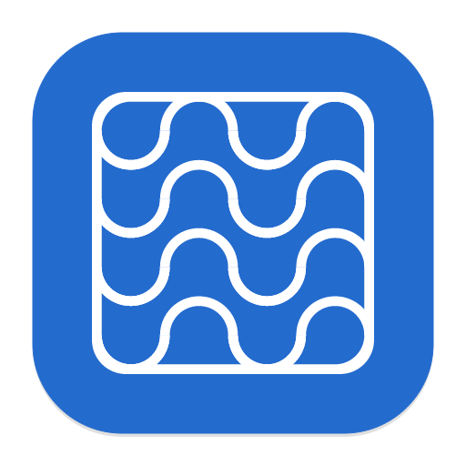

<p align="center">
  
</p>

<h1 align="center">Prodex</h1>

<p align="center">Keep building while your coding agent is busy.</p>

Prodex finds useful work that can happen alongside your current coding session. It reads your project's goals and code, suggests independent tasks, and runs the ones you approve with Codex or Claude Code. A small desktop app lets you manage suggestions, follow progress, and merge completed work locally.

**Early preview · macOS · Build from source.** The core workflow is implemented, but real-provider testing, recovery, and installation still need work. There is no packaged installer yet. See the [release checklist](docs/release-readiness.md) for current gaps.

<p align="center">
  
</p>

## How it works

1. **Choose a project.** Use **Add projects** to select a folder. Prodex only plans work for projects you connect.
2. **Keep coding.** An interactive Codex terminal session in that folder activates discovery. Prodex looks for useful parallel work based on the repository's documented goals and current code.
3. **Approve an idea.** Suggestions require your approval before a coding worker starts. Codex and Claude Code are supported worker providers.
4. **Follow the work.** See progress in Activity, stop a task, or open its session in a supported terminal or app.
5. **Merge when ready.** **Merge locally** starts a background integration job. Prodex marks the result integrated only after checking that the committed changes reached the original project. It does not push to GitHub or create a PR.

Coding tasks use separate Git worktrees by default. You can choose main-folder coding per project in Settings; those tasks run one at a time within that project. If a project needs its first Git commit, Prodex proposes a setup task for approval.

## Installation

These instructions target **macOS**. The core uses Unix APIs; Linux desktop support is not validated, and Windows is not supported by the current implementation.

### Requirements

- Git and Apple's Xcode Command Line Tools (`xcode-select --install`).
- A current stable Rust toolchain with Cargo, supporting Rust edition 2024.
- Node.js **22.12 or newer** and npm. The repository pins Node 24.20.0 and npm 11.19.0 for Volta users.
- The `codex` CLI installed, authenticated, and available on your shell's `PATH` for the default workflow.
- Optional: the `claude` CLI and an `ANTHROPIC_API_KEY` for Claude workers. See [provider configuration](#provider-configuration).

The desktop uses Tauri 2. Check its [platform prerequisites](https://v2.tauri.app/start/prerequisites/) if the native build fails.

### 1. Clone and build

```sh
git clone https://github.com/danielstens0n/prodex.git
cd prodex
cargo build --workspace --locked
```

### 2. Start the background service

From the repository root:

```sh
./target/debug/prodex start
./target/debug/prodex status
```

The service detaches from your terminal. It runs planning and coding tasks independently of the desktop window.

### 3. Open the desktop app

```sh
cd apps/desktop
npm ci
npm run tauri dev
```

Keep this development command running while using the app. If you use Volta, you can run it explicitly with the pinned toolchain:

```sh
volta run --node 24.20.0 --npm 11.19.0 npm run tauri dev
```

### 4. Connect your first project

In **Activity**, click **Add projects** and select your project folder. In a separate terminal, start an interactive Codex session inside that project. Prodex can also detect an existing session.

Discovery starts for connected projects with an observed session. Review a suggestion and approve it to start coding. **Check now** requests a planning pass; it still respects service limits and may return no suggestions when there is no clear independent task.

Prodex asks the planner for up to ten worthwhile ideas in priority order and shows the top three pending suggestions. Approving or rejecting one reveals the next idea in the reserve. When fewer than three remain, planning can refill even while workers are busy; cooldowns and daily limits still apply. It may return fewer ideas when the project does not support useful independent work.

Settings controls concurrency, the free-slot threshold for reserve planning, planning frequency, daily planning limits, and the suggestion risk ceiling. Every suggested coding task currently requires approval, regardless of risk.

## Provider configuration

Run these commands from the Prodex repository root while the service is running. Codex is the default planner and worker:

```sh
./target/debug/prodex configure --provider codex --planner-provider codex
```

To keep Codex planning but use Claude for coding:

```sh
./target/debug/prodex configure --provider claude --planner-provider codex
```

For Claude, make `ANTHROPIC_API_KEY` available in the shell **before starting the service**. This adapter uses API-key authentication; it does not use your Claude subscription login. Changing the desktop's environment does not change the running service's environment.

Provider interfaces are version-sensitive. See the [Codex adapter notes](docs/codex-integration.md) and [Claude adapter notes](docs/claude-integration.md) for implementation details. The current Claude coding profile permits reading and editing files but does not enable shell commands for ordinary coding tasks, so those workers cannot run test suites themselves.

## Service controls and troubleshooting

Closing the desktop leaves the service and its workers running. From the repository root:

```sh
./target/debug/prodex status
./target/debug/prodex events --follow
./target/debug/prodex pause       # Pause discovery and new launches; workers continue
./target/debug/prodex resume
./target/debug/prodex stop TASK_ID
./target/debug/prodex shutdown    # Stop managed work and shut down the service
```

**The app says the service needs an update.** `npm run tauri dev` starts the desktop only. Rebuilding or restarting it does not replace the running daemon. Finish or stop your managed work before updating, then run from the repository root:

```sh
git pull --ff-only
cargo build --workspace --locked
./target/debug/prodex shutdown
./target/debug/prodex start
```

Then restart `npm run tauri dev` from `apps/desktop`. Shutdown preserves files and history, but unfinished work, including pending suggestions, can become interrupted. Seamless upgrades are still on the roadmap.

**No suggestions appear.** Check that the project is connected, a live interactive Codex terminal session is detected, and planning is not paused or limited by capacity, cooldown, or daily limits. A full ten-idea backlog waits for you to handle suggestions before planning more. Claude-only, desktop-only, IDE-only, and remote sessions do not currently activate discovery.

**The app cannot connect.** Run `./target/debug/prodex status`. The app and service must use the same `PRODEX_STATE_DIR`. By default, state and logs live in `~/.local/state/prodex`, with daemon output in `daemon.log`. A custom state directory should be dedicated to Prodex, not an existing project folder.

**Planning resumes when you reopen the app.** The current desktop can resume discovery for previously enabled projects. A CLI pause is not a persistent off switch across desktop restarts; this behavior is a known release gap.

## Data and costs

Prodex stores tasks, events, planner notes, and worktrees locally. It detects session presence through local processes; it does not read your main coding conversation. Planning and worker sessions can send repository context to the configured model provider through its CLI. Local coordination does not mean offline model execution.

Provider usage may incur charges. Concurrency, daily launch limits, and timeouts constrain work, but **there is no monetary spending cap yet**. Avoid sharing credentials or sensitive project content in public issue reports or diagnostic logs.

## Contributing

Bug reports, documentation improvements, and focused pull requests are welcome. For larger changes, [open an issue](https://github.com/danielstens0n/prodex/issues) first to discuss the approach. Include reproduction steps, your macOS and provider CLI versions, and relevant redacted errors when reporting a bug.

The project consists of a Rust service and CLI, plus a Tauri desktop app with TypeScript. Start with the [architecture](docs/architecture.md), [development guide](docs/development.md), and [desktop notes](apps/desktop/README.md).

Run checks relevant to your changes:

```sh
# From the repository root
cargo fmt --all -- --check
cargo clippy --workspace --all-targets -- -D warnings
cargo test --workspace

# Desktop
cd apps/desktop
npm ci
npm run build
npx playwright install chromium
npm run test:ui
cargo check --manifest-path src-tauri/Cargo.toml
```

Run `./scripts/test-e2e.sh` for the complete deterministic suite: real daemon/provider-process/Git workflows, Rust checks, and browser interactions. See the [end-to-end testing guide](docs/e2e-testing.md) for requirements and coverage. Provider executables and browser service responses are simulated; authenticated provider workflows remain a separate gate in the [release checklist](docs/release-readiness.md).

## License

The Cargo packages declare MIT licensing. A standalone project license file still needs to be added before the licensing setup is complete. Bundled fonts and icons include their own license notices under `apps/desktop/public/`.
